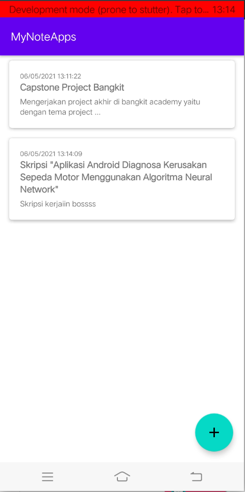
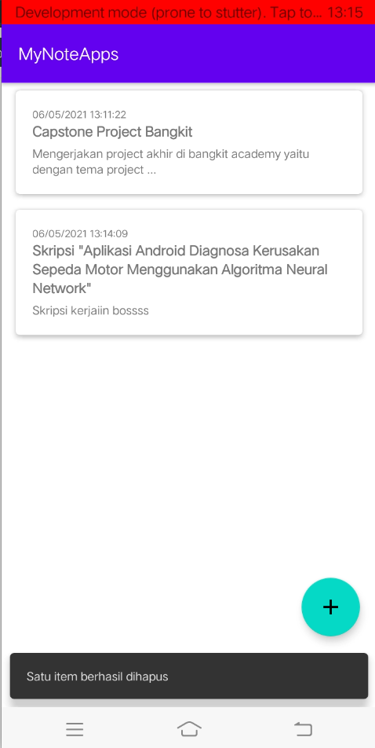

# MyNotesApp


## Installation
Clone this repository and import into Android Studio
```
https://github.com/Nauvalps/MyNoteApps.git
```


## ScreenSHot
<p align="left">
    
    
    
    
</p>


<p align="left">
    
    
        
</p>

## Feature :
- Using MVVM (Model-View-ViewModel) Architecture
- Using Room Persistence for local database
- Using ViewBinding

## Dependencies :
- [Lifecycle & Livedata](https://developer.android.com/jetpack/androidx/releases/lifecycle)
- [Room](https://developer.android.com/jetpack/androidx/releases/room)
- [CardView](https://developer.android.com/jetpack/androidx/releases/cardview)
- [RecyclerView](https://developer.android.com/jetpack/androidx/releases/recyclerview)

## Pull Requests
I encourage all the developers out there to contribute to the repository and help me to expand it. To contribute just think up of an example which could be a feature or some demo to how to use a library. Develop the demo and create a pull request and you are in.

## Support me
> Just  **star** or  **fork** this repository, and follow my github. You have *supported* me!

## Author
[**Nauval Purnomo Sidi**](https://www.linkedin.com/in/nauval-purnomo-sidi-536123184/) - nauvalpurnomosidi@gmail.com

## License
```

Copyright © 2021 Nauval Purnomo Sidi

Licensed under the Apache License, Version 2.0 (the "License");
you may not use this file except in compliance with the License.
You may obtain a copy of the License at

http://www.apache.org/licenses/LICENSE-2.0

Unless required by applicable law or agreed to in writing, software
distributed under the License is distributed on an "AS IS" BASIS,
WITHOUT WARRANTIES OR CONDITIONS OF ANY KIND, either express or implied.
See the License for the specific language governing permissions and
limitations under the License.

```
